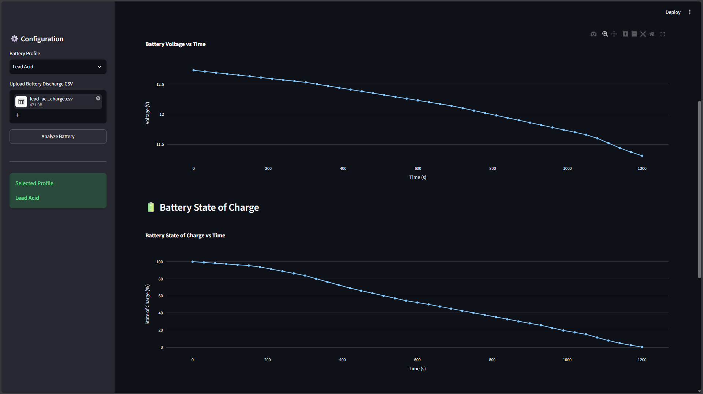
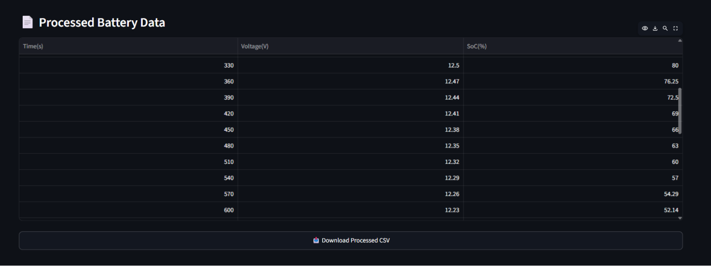
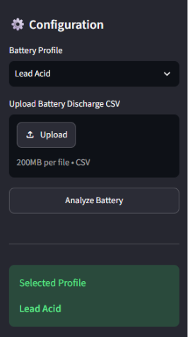

# 🔋 Battery State of Charge Estimator


An interactive **Battery State of Charge (SoC) Estimator** built using **Python**, **Streamlit**, **Pandas**, **NumPy**, and **Plotly**. The application estimates battery State of Charge using configurable voltage profiles for multiple battery chemistries and presents the results through an interactive dashboard.

---

## 🌐 Live Demo

🚀 **Try the live application here:**

[battery-soc-estimator](https://battery-soc-estimator.streamlit.app/)

---

## 📸 Dashboard



---

# 📖 Overview

Battery **State of Charge (SoC)** represents the remaining usable capacity of a battery and is one of the most important parameters in a Battery Management System (BMS).

This project estimates the remaining battery charge by comparing measured terminal voltage against configurable voltage-to-SoC lookup tables. Users can upload battery discharge datasets, visualize discharge behaviour, generate battery statistics, and export processed results through an interactive Streamlit dashboard.

---

# ✨ Features

- 🔋 Supports **Lithium-Ion**, **LiFePO₄**, and **Lead Acid** battery chemistries
- 📂 Upload custom battery discharge datasets in CSV format
- ⚡ Voltage-based State of Charge estimation using interpolation
- 📊 Interactive battery summary
- 📈 Interactive Plotly visualizations
- 📥 Export processed battery data as CSV
- 🧩 Modular Python project structure
- 🌐 User-friendly Streamlit dashboard

---

# 🖼️ Application Preview

## Dashboard


---

## Processed Battery Data



---

## Configuration Panel



---

# ⚙️ Workflow

```text
Select Battery Profile
        │
        ▼
Upload Battery Discharge CSV
        │
        ▼
Load Battery Voltage Profile
        │
        ▼
Estimate SoC using Voltage Interpolation
        │
        ▼
Generate Battery Statistics
        │
        ▼
Interactive Dashboard
        │
        ▼
Download Processed CSV
```

---

# 📁 Project Structure

```text
Battery-SOC-Estimator/
│
├── app.py
├── README.md
├── requirements.txt
│
├── images/
│   ├── dashboard.png
│   ├── processed-data.png
│   └── sidebar.png
│
├── data/
│   ├── profiles/
│   │   ├── lithium_ion.csv
│   │   ├── lifepo4.csv
│   │   └── lead_acid.csv
│   │
│   └── raw/
│       ├── lithium_ion_discharge.csv
│       ├── lifepo4_discharge.csv
│       └── lead_acid_discharge.csv
│
├── src/
│   ├── data_loader.py
│   ├── profile_loader.py
│   ├── soc_estimator.py
│   ├── statistics.py
│   └── visualization.py
│
└── outputs/
```

---

# 🚀 Installation

Clone the repository

```bash
git clone https://github.com/Shv8ank/Battery-SOC-Estimator.git
```

Move into the project directory

```bash
cd Battery-SOC-Estimator
```

Create a virtual environment

### Windows

```bash
python -m venv .venv
.venv\Scripts\activate
```

### macOS / Linux

```bash
python3 -m venv .venv
source .venv/bin/activate
```

Install dependencies

```bash
pip install -r requirements.txt
```

---

# ▶️ Run the Application

```bash
streamlit run app.py
```

Open your browser and visit

```text
http://localhost:8501
```

---

# 📄 Sample Datasets

The repository contains sample discharge datasets and voltage profiles for:

- 🔋 Lithium-Ion
- 🔋 LiFePO₄
- 🔋 Lead Acid

These datasets can be found inside:

```text
data/raw/
```

with their corresponding battery profiles located in:

```text
data/profiles/
```

---

# 🛠️ Technologies Used

| Category | Technology |
|-----------|------------|
| Programming Language | Python |
| Web Framework | Streamlit |
| Data Processing | Pandas, NumPy |
| Visualization | Plotly |
| Data Storage | CSV |
| Version Control | Git & GitHub |

---

# 🔮 Future Improvements

- 🤖 Machine Learning based SoC prediction
- 🔋 Battery State of Health (SoH) estimation
- 🌡️ Temperature-compensated battery models
- 📡 Real-time Battery Management System (BMS) integration
- 🌐 REST API support
- ☁️ IoT dashboard integration
- 📱 Mobile-friendly interface

